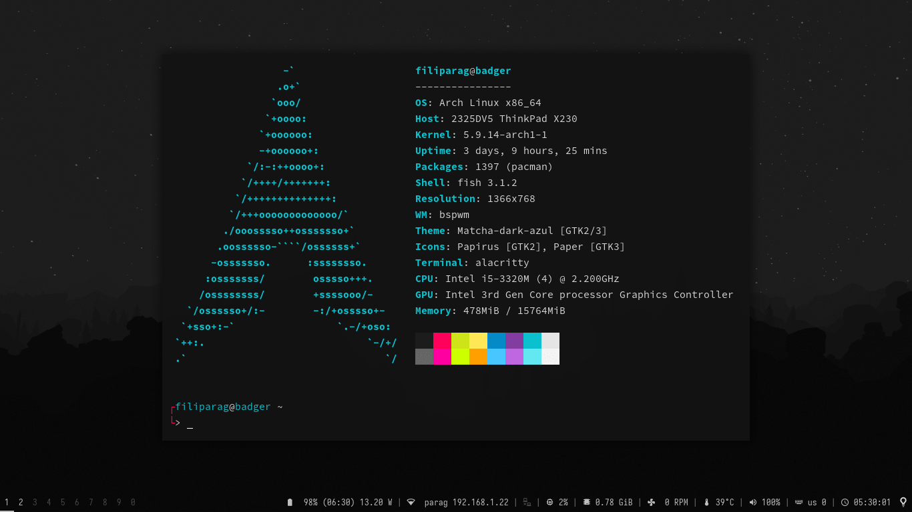

# Dotfiles for Arch Linux

This repository comprises an extensive assortment of modular scripts and configuration files built upon [ArchLinux](https://wiki.archlinux.org/title/Arch_Linux) and [bspwm](https://github.com/baskerville/bspwm). Its objective is to deliver a stable, clutter-free, and ergonomic desktop environment tailored for advanced users.

All updates and enhancements aim to avoid unnecessary breaking changes, aligning closely with the rolling-release nature of the underlying system, while requiring minimal maintenance.



## Installation

### Prerequisites
- [base Arch Linux](https://wiki.archlinux.org/index.php/Installation_guide) installed
- at least 8 GiB of free space on system partition
- user account with [`sudo`](https://wiki.archlinux.org/index.php/Sudo#Example_entries) privileges

### Steps
```shell
# Clone dotfiles repository
git clone https://github.com/filiparag/dotfiles.git && cd dotfiles

# Install dependencies
make dependencies

# Choose and install optional dependencies
make optional-dependencies

# Install dotfiles for your user (pick one)
make symlink    # place symlinks to files (recommended)
make copy       # place copies of files

# Reboot your system to apply all modifications (optional)
reboot
```

**Note:** Running make targets for installing dotfiles will replace existing configuration files in the filesystem. Be sure to back them up beforehand.

**Updating dotfiles**

After every repository update, install dependencies and reload dotfiles:

```shell
dotfiles deps
dotfiles reload
```

## Usage and customization

### Shortcuts

Keyboard shortcuts [manual](./SHORTCUTS.md) can be opened with `dotfiles docs` after installing dotfiles.

Keyboard shortcuts configuration:[`~/.config/sxhkd/sxhkdrc`](./src/HOME/.config/sxhkd/sxhkdrc)

Touchpad gestures configuration: [`~/.config/libinput-gestures.conf`](./src/HOME/.config/libinput-gestures.conf)

### Configuring the environment

Window manager configuration ([wmrc](https://github.com/filiparag/wmrc/)):
[`~/.config/wmrc/rc.conf`](./src/HOME/.config/wmrc/rc.conf)

Startup applications and daemons are listed in `APPS` variable in
[`~/.config/wmrc/modules/services/apps`](./src/HOME/.config/wmrc/modules/services/apps#L5)

User-specific environment variables:
[`~/.config/fish/conf.d/user.fish`](./src/HOME/.config/fish/conf.d/user.fish)

Wallpaper and lockscreen images are located in [`~/Pictures`](./src/HOME/Pictures) directory.

To set default monitor setup, create desired layout using `arandr`
and save it as `~/.screenlayout/Default.sh`

### Security and remote access

By default, all incoming network traffic is blocked except for:
- *SSH*: port `22/tcp` with public key authentication only
- *Syncthing*: ports `22000/tcp` and `21027/udp`
- *KDE Connect*: port range `1714:1764/tcp+udp`

To enable [VNC server](https://wiki.archlinux.org/index.php/TigerVNC), run:
``` bash
# Set VNC password
vncpasswd

# Allow incoming VNC connections
sudo ufw allow in 5900/tcp

# Start VNC module
wmrc start services/vnc
```

### Hardware-specific modifications

#### Battery life optimization

Provided [auto-cpufreq](https://github.com/AdnanHodzic/auto-cpufreq) configuration [file](./src/etc/auto-cpufreq.conf)
is optimized for CPUs with Energy-Performance Preference support. It is recommended to enable it on battery-powered devices.

To enable it, run:
```bash
# Install
paru -S auto-cpufreq

# Enable and start service
sudo systemctl enable --now auto-cpufreq
```

#### X11 video drivers

By default, dotfiles come bundled with configuration and open-source drivers for [Intel](https://archlinux.org/packages/extra/x86_64/xf86-video-intel/) and [AMD](https://archlinux.org/packages/extra/x86_64/xf86-video-amdgpu/) graphics cards. If your hardware isn't supported by those:

- install appropriate [video driver](https://wiki.archlinux.org/index.php?title=Xorg#Driver_installation)
- make sure you have proper configuration file in [`/etc/X11/xorg.conf.d/`](./src/etc/X11/xorg.conf.d/)

